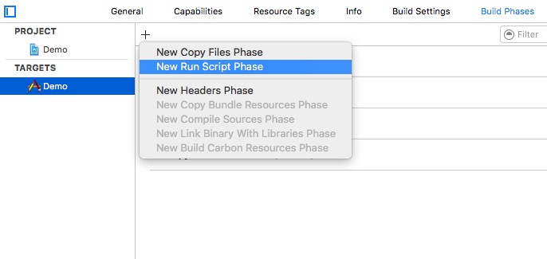
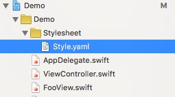
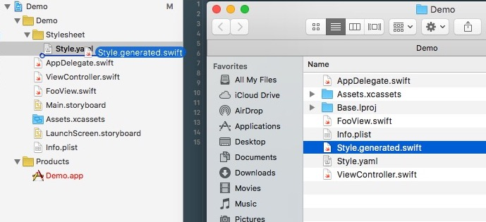

<p align="center">


[](#)
[](#)
[](https://opensource.org/licenses/MIT)


_Get strong typed, autocompleted resources, color swatches and font styles in Swift projects from as simple, human readable Yaml stylesheet_

**S** is inspired (and complementary) to **R**.

This:

```yaml

Color:
  blue: "#00ff00" #values can be colors, font, images, numbers or bool
  red: #properties can also have different values (when different conditions match)
    "horizontal = compact and idiom = phone": "#aa0000" 
    "default": "#ff0000"

Typography:
  small: Font("Helvetica", 12) #font (use System or SystemBold as font names to use the system font)
  
FooView:
  background: $Color.red #properties can also redirect to other style's properties
  font: $Typography.small
  defaultMargin: 10

```

is transformed into a strongly typed, stylesheet in swift

```swift 

///Entry point for the app stylesheet
struct S {
	static let Color = ColorStyle()
	struct ColorStyle {

		let blue = UIColor(red: 0.0, green: 1.0, blue: 0.0)
		var red: UIColor { return self.redWithTraitCollection() }

		func redWithTraitCollection(trait: UITraitCollection? = UIScreen.mainScreen().traitCollection) -> UIColor {
			let device = UIDevice.currentDevice()
			if device.userInterfaceIdiom == .Phone  && trait?.horizontalSizeClass == .Compact {
             	return UIColor(red: 0.8, green: 0, blue: 0)
            	}
			return UIColor(red: 1, green: 0, blue: 0)
		}
	}
    
	static let Typography = TypographyStyle()
	struct TypographyStyle {
		let small = UIFont(name: "Helvetica", size: 12.0)!
	}
	
	static let FooView = FooViewStyle()
	struct FooViewStyle {
		var background: UIColor { return Color.red  }
		var font: UIFont { return Typography.small }
		let defaultMargin: CGFloat = 10 
	}
    
}

```
And you can access to it by simply typing  `S.Color.red` 

The stylesheet supports colors (with some helper function like darken, lighten, gradient), fonts, images, metrics and bools.


Like in the example it supports complex conditions for the value that take the screen size, the size class and the user interaction idiom into account.
(`S.Color.red` could be a different value given a different screen size/size class/idiom). See the stylesheet section for more info about it.


## Installation
One line installation.
Copy and paste this in your terminal.

```
git clone https://github.com/alexdrone/S.git && cd S && cp sgen /usr/local/bin/sgen && chmod +x /usr/local/bin/sgen
```

The usage of the generator is as simple as 
```
sgen $SRCROOT
```

## Adding S as a build script

You can integrate **S** in your build pashes by adding it as a build script.

- Click on your **TARGET** abd go the **Build Phases** tab.
- Click on the **+** and select **New Run Script Phase** 

<p align="center">


- Expand the **Run script** section
- Add `sgen $SRCROOT` in the script

<p align="center">


- Now you can create your `.yaml` stylesheet. Make sure it is placed inside your project source root (`$SRCROOT`)

<p align="center">


[](https://github.com/Carthage/Carthage)
[](#)
[](#)
[](https://opensource.org/licenses/MIT)


- The first time you build your target (with `cmd + B`) you need to drag the generated file inside the project. The generated swift file sits next to your stylesheet so, simply right click on your yaml stylesheet and select **Show in Finder** and drag the  `*.generated.swift` file inside your project


<p align="center">


- Et voilà! Every time you will build your target the generated file will be updated as well.

## Stylesheet 

The following is the grammaer of the YAML stylesheet.
Is supports simple values (bool, metrics, fonts, colors, images), conditional values and redirects (by simply using $ + Section.key)

```yaml

SECTION_1:
  KEY: VALUE 	#simple value
  KEY: 			#conditional value
  	"CONDITION": VALUE
  	"CONDITION": VALUE
  	...
  	"default": VALUE	#every conditional value should have a 'default' condition
  KEY: VALUE

SECTION_2:
  KEY: VALUE
  KEY: $SECTION_1.KEY #redirect
  
SECTION_3 < SECTION_2: #this style inherits from another one
  KEY: VALUE
  KEY: $SECTION.KEY #redirect

```

The value part can be formed in the following ways:

```
	VALUE := COLOR | FONT | NUMBER | BOOL | IMAGE | REDIRECT
	COLOR := "#HEX" // e.g. "#aabbcc"
	FONT := Font("FONT_NAME", NUMBER) // e.g. Font("Arial", 12) (use System or SystemBold to use the system font)
	IMAGE := Image("IMAGE_NAME") // e.g. Image("cursor")
	NUMBER := (0-9)+ //e.g. 42, a number
	BOOL := true|false
	REDIRECT := $SECTION.KEY //e.g. $Typography.small
```

A condition has instead the following form

```
	CONDITION := 'EXPR and EXPR and ...' //e.g. 'width < 200 and vertical = compact and idiom = phone'
	EXPR := SIZE_CLASS_EXPR | SIZE_EXPR | IDIOM_EXPR 
	SIZE_CLASS_EXPR := (horizontal|vertical)(=|!=)(regular|compact) // e.g. horizontal = regular
	SIZE_EXPR := (width|height)(<|<=|=|!=|>|>=)(SIZE_PX) //e.g. width > 320
	SIZE_PX := (0-9)+ //e.g. 42, a number
	IDIOM_EXPR := (idiom)(=|!=)(pad|phone) //e.g. idiom = pad

```

